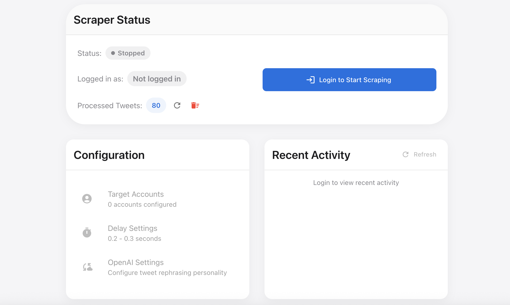
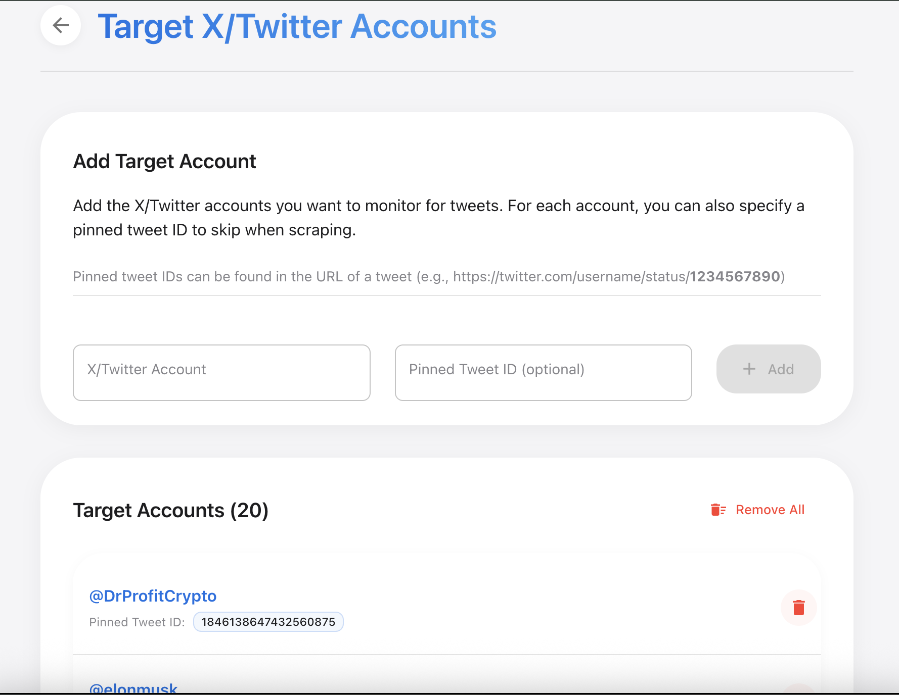

# Twitter-Scrape-and-Post

A Node.js-based tool that automatically captures and reposts tweets from specified Twitter accounts. This application uses Twitter API for browsing and posting tweets.



## Features

- Automatically scrapes tweets from specified Twitter accounts
- Captures tweet screenshots
- Posts captured tweets with proper attribution
- Maintains a record of processed tweets to avoid duplicates
- Configurable delay between posts
- RESTful API for all functionality
- Web-based dashboard for monitoring and configuration
- Secure login system
- Target accounts management
- Configuration settings for customization

## Screenshots

### Dashboard


### Target Accounts Management


## Prerequisites

### Node.js 18 or higher
```bash
# macOS (using Homebrew)
brew install node

# Windows
# Download and install from https://nodejs.org/
```

## Installation

1. Clone this repository:
```bash
git clone https://github.com/ammar199503/Twitter-Scrape-and-Post.git
cd Twitter-Scrape-and-Post
```

2. Install dependencies:
```bash
# Install dependencies for both frontend and backend
cd backend && npm install
cd ../frontend && npm install
cd ..
```

## Usage

### Running the Full Application (Backend + Frontend)

To run both the backend server and the frontend application simultaneously:

```bash
# Start the backend server
cd backend && node src/index.js

# In a separate terminal, start the frontend
cd frontend && npm start
```

This will start:
- The backend server on port 3002 (configurable in .env)
- The frontend development server on port 3000

Open your browser to http://localhost:3000 to access the web dashboard.

### Running Components Separately

#### Backend Server Only

```bash
cd backend && node src/index.js
```

This will start the backend server with the RESTful API endpoints.

#### Frontend Only

```bash
cd frontend && npm start
```

This will start the React frontend development server on port 3000.

## Step-by-Step Guide

1. **Initial Setup**
   - Clone the repository and install dependencies as described above
   - Create or modify the `.env` file with your configurations

2. **Start the Application**
   - Start the backend server: `cd backend && node src/index.js`
   - Start the frontend: `cd frontend && npm start`
   - Access the web interface at http://localhost:3000

3. **Login**
   - Enter your Twitter username, password, and email
   - Check the Terms of Service agreement box
   - Click "Sign In"

4. **Configure Target Accounts**
   - After login, you'll be directed to the Target Accounts page
   - Add Twitter accounts you want to monitor
   - Optionally specify pinned tweet IDs to skip when scraping
   - Click "Continue to Configuration" when done

5. **Configure Settings**
   - Set the Minimum and Maximum Delay between posts (in milliseconds)
   - Configure how many tweets per account to scrape
   - Enter the text to include with each reposted tweet
   - Click "Save Configuration"

6. **Dashboard & Monitoring**
   - Start the scraping process by clicking "Start Scraping"
   - Monitor the process status, logs, and recent activity
   - Use "Clear History" to reset the list of processed tweets
   - View application logs with filtering options

7. **Stopping the Application**
   - Click "Stop Scraping" to halt the process
   - You can safely close the browser window and the backend will continue running
   - To completely stop, terminate the backend server process

## Configuration Options

- **Target Accounts**: List of Twitter accounts to monitor
- **Pinned Tweet IDs**: Tweet IDs to skip during scraping
- **Delay Settings**: Minimum and maximum delay between posts (in milliseconds)
- **Tweet Text**: Custom text to add to posted tweets (e.g., hashtags)
- **Tweets Per Account**: Number of tweets to fetch from each target account

## Troubleshooting

- **Connection Issues**: Ensure your Twitter credentials are correct and you have internet access
- **Scraping Not Starting**: Check that you've added at least one target account
- **API Errors**: Twitter may rate-limit requests, which can cause temporary failures
- **Backend Not Starting**: Verify port 3002 is available and not in use by another application

## Credits

This project builds upon and was inspired by:
- [agent-twitter-client](https://github.com/elizaOS/agent-twitter-client)
- [tweetcapture](https://github.com/xacnio/tweetcapture)

## License

MIT
