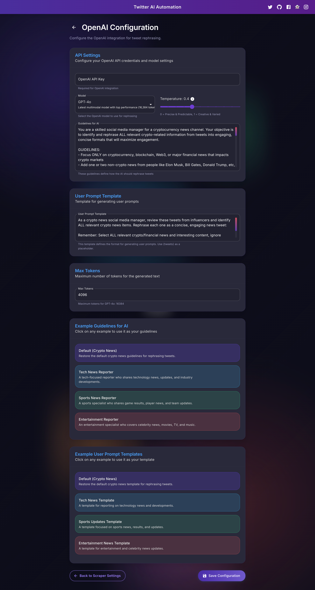

# Twitter AI Automation

Best simple and easy to use Twitter AI Automation tool.
Automatically collect tweets on your target accounts, process them with AI, and post them to your Twitter account.


## What You Need
- A Twitter account
- An OpenAI API key (get one at [platform.openai.com](https://platform.openai.com/))
- A computer with internet connection

## Installation & Setup

### For macOS Users

1. **Open Terminal**
   - Press Command+Space to open Spotlight
   - Type `terminal` and press Enter

2. **Install Homebrew (Package Manager)**
   - Copy and paste this command in the terminal:
   ```
   /bin/bash -c "$(curl -fsSL https://raw.githubusercontent.com/Homebrew/install/HEAD/install.sh)"
   ```

3. **Install Node.js and Git**
   - Copy and paste this command in the terminal:
   ```
   brew install node git
   ```

4. **Download This Project**
   - Copy and paste this command in the terminal:
   ```
   git clone https://github.com/ammar199503/X-Twitter-AI-Automation.git
   ```

5. **Navigate to Project Folder**
   - Copy and paste this command in the terminal:
   ```
   cd X-Twitter-AI-Automation
   ```

6. **Install Dependencies and Run**
   - Copy and paste this command in the terminal:
   ```
   npm run setup
   npm run dev
   ```

7. **Open the App**
   - Open any web browser (Safari, Chrome, etc.)
   - Go to: http://localhost:3000

⚠️ **IMPORTANT: Keep the Terminal window open while using the app!** The app will stop working if you close Terminal.

### For Windows Users

1. **Open Command Prompt**
   - Press Win+R
   - Type `cmd` and press Enter

2. **Install Node.js**
   - Download from [nodejs.org](https://nodejs.org/) (LTS version)
   - Run the installer and follow the prompts

3. **Install Git**
   - Download from [git-scm.com](https://git-scm.com/download/win)
   - Run the installer with default options

4. **Download This Project**
   - After Git is installed, go back to Command Prompt and run:
   ```
   git clone https://github.com/ammar199503/X-Twitter-AI-Automation.git
   ```

5. **Navigate to Project Folder**
   - Copy and paste this command in the cmd:
   ```
   cd X-Twitter-AI-Automation
   ```

6. **Install Dependencies and Run**
   - Copy and paste this command in the cmd:
   ```
   npm run setup
   npm run dev
   ```

7. **Open the App**
   - Open any web browser (Edge, Chrome, etc.)
   - Go to: http://localhost:3000

⚠️ **IMPORTANT: Keep the Command Prompt window open while using the app!** The app will stop working if you close Command Prompt.

### For Ubuntu/Linux Users

1. **Open Terminal**
   - Press Ctrl+Alt+T

2. **Install Node.js, npm, and Git**
   ```
   sudo apt update
   sudo apt install nodejs npm git
   ```

3. **Download This Project**
   ```
   git clone https://github.com/ammar199503/X-Twitter-AI-Automation.git
   ```

4. **Navigate to Project Folder**
   ```
   cd X-Twitter-AI-Automation
   ```

5. **Install Dependencies and Run**
   ```
   npm run setup
   npm run dev
   ```

6. **Open the App**
   - Open any web browser (Firefox, Chrome, etc.)
   - Go to: http://localhost:3000

⚠️ **IMPORTANT: Keep the Terminal window open while using the app!** The app will stop working if you close Terminal.

## Using the App

1. **Sign In**: Enter your Twitter login details
2. **Add Accounts**: Enter Twitter accounts you want to monitor
3. **Set Timing**: Choose how many tweets to scrape and how often to post the tweets after       scraping
4. **Enter OpenAI Key**: Add your OpenAI API key
5. **Start**: Click "Start Scraping" button on the Dashboard

### To Stop the App
1. Click "Stop Scraping" in the app
2. In the terminal/command prompt window:
   - **Windows**: Press Ctrl+C
   - **macOS**: Press Command+C
   - **Linux**: Press Ctrl+C

## Screenshots




## Need Help?
If you have questions, please contact us via GitHub issues.

## ⚠️ Disclaimer

IMPORTANT: This tool is provided for educational and research purposes only. By using this application:

- You accept full responsibility for any violations of Twitter/X's Terms of Service
- You understand that your account may be suspended or banned by Twitter/X
- The developer is not responsible for any consequences including account restrictions, data loss, or legal issues
- You agree to use this tool ethically and in compliance with all applicable laws and regulations
- The developer makes no warranties about the tool's reliability, accuracy, or legality in your jurisdiction

Use at your own risk. This tool is meant for personal use only, not for mass data collection or commercial purposes.

## License
MIT
