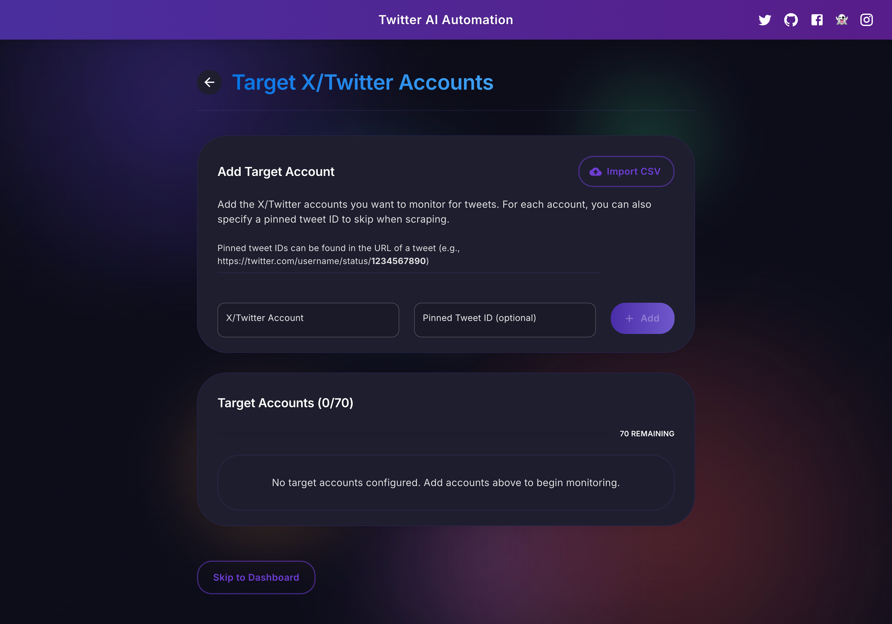

# X-Twitter AI Automation 🤖 🚀

A powerful Node.js application that automates the process of capturing tweets from specified Twitter/X accounts, processing them with OpenAI to extract relevant news, and reposting them to your Twitter account. All of this is accomplished without requiring a Twitter API key - just your regular Twitter credentials.


## ✨ Overview

This tool serves as an intelligent content aggregator that:
- Monitors tweets from accounts you specify
- Uses AI to identify relevant content based on your criteria
- Reformats and reposts the information to your account
- Maintains a professional appearance with proper attribution
- Avoids duplicate content through intelligent tracking

## 🚀 Features

- **Zero API Key Requirement**: Uses your Twitter credentials for browsing and posting tweets - no Twitter API key needed
- **Intelligent Content Processing**: Leverages OpenAI to identify and extract relevant content from tweets
- **Targeted Account Monitoring**: Easily configure which Twitter accounts to monitor
- **Automated Posting**: Automatically posts processed tweets with proper formatting
- **Duplicate Prevention**: Maintains records of processed tweets to avoid duplicates
- **Real-time Monitoring**: Web-based dashboard shows status, logs, and activities
- **Secure Authentication**: Robust error handling for Twitter login and authentication challenges
- **CSV Import Support**: Bulk import target accounts from CSV files
- **Bot Detection Protection**: Advanced strategies to avoid Twitter's automation detection
- **Configurable Settings**: Control delays, tweet volume, and AI parameters
- **Graceful Shutdown**: Options for immediate or gradual stopping of the scraper

## 📸 Screenshots

### Dashboard


### Target Accounts Management


### Scraper & Delay Settings


### API Configuration


## 📋 Prerequisites

Here's what you need to get started:

- **Node.js 18 or higher**
  
  Node.js is the platform that powers this application. To check if you have it installed, open your terminal and type:
  ```bash
  node -v
  ```
  
  If you see a version number (like v18.x.x), you're set. If not, install it from [nodejs.org](https://nodejs.org/).

- **Twitter/X Account**
  - You only need a standard Twitter/X account (free)
  - **NO Twitter Developer Account or API keys needed**
  - Have your Twitter username, password, and email ready for login

- **OpenAI API Key**
  - Sign up at [OpenAI](https://platform.openai.com/)
  - Navigate to the API section and create a new API key
  - Make sure you have credits available on your OpenAI account

- **Git** (for cloning the repository)

## 🔧 Installation

1. **Clone the repository**:
   ```bash
   git clone https://github.com/ammar199503/X-Twitter-AI-Automation.git
   cd X-Twitter-AI-Automation
   ```

2. **Install all dependencies**:
   ```bash
   npm run setup
   ```

   This comprehensive setup script installs all required packages for the frontend, backend, and root project.

### Troubleshooting Installation

If you encounter any errors during the installation process, try these steps:

1. **Missing modules error:**
   ```bash
   # Remove node_modules and package-lock.json files
   rm -rf node_modules package-lock.json
   rm -rf backend/node_modules backend/package-lock.json
   rm -rf frontend/node_modules frontend/package-lock.json
   
   # Clean npm cache
   npm cache clean --force
   
   # Reinstall all dependencies
   npm install
   cd backend && npm install
   cd ../frontend && npm install
   cd ..
   ```

2. **Node version issues:**
   - Verify your Node.js version (this project requires Node.js 18 or higher):
   ```bash
   node -v
   ```
   - If your Node version is below 18, update it

## 🚀 Running the Application

1. **Start the complete application**:
   ```bash
   npm run dev
   ```

   This launches both the frontend and backend servers simultaneously.

2. **Or run components individually**:
   ```bash
   # Backend only
   npm run backend
   
   # Frontend only
   npm run frontend
   ```

3. **Access the application**:
   - Frontend interface: http://localhost:3000
   - Backend API: http://localhost:3002

## 🏗️ Architecture

The application consists of two main components:

### Backend (Node.js)
- **REST API**: Handles all Twitter interactions and OpenAI processing
- **Twitter Integration**: Uses agent-twitter-client for browser-based Twitter interaction
- **OpenAI Integration**: Processes tweets to extract relevant information
- **Configuration Management**: Stores and manages application settings
- **Logging System**: Comprehensive logging for troubleshooting

### Frontend (React)
- **Dashboard**: Real-time monitoring of scraper status
- **Configuration Pages**: Easy setup of target accounts and system settings
- **User-friendly Interface**: Modern, responsive design built with Material UI
- **Authentication**: Secure Twitter login management

## 💡 Step-by-Step Usage Guide

### Initial Setup

1. Start the application with `npm run dev`
2. Access http://localhost:3000 in your browser
3. Log in with your Twitter credentials (these are used locally and not stored remotely)

### Target Account Configuration

1. After login, add Twitter accounts to monitor (e.g., @elonmusk, @vitalikbuterin)
2. Optionally specify pinned tweet IDs to skip during scraping
3. Save your configuration before proceeding

### Application Settings

1. **Scraper Settings**: Configure delays between posts and tweets per account
2. **OpenAI Configuration**: Set up your API key, model, and customize tweet processing parameters
3. **Dashboard**: Monitor status, view logs, and control the scraping process

### Authentication & Bot Protection

The application includes robust handling for Twitter authentication and bot detection:

- Human-like behavior patterns with randomized delays
- Intelligent error handling for verification challenges
- Automatic cookie management for better session persistence
- Clear guidance when authentication issues occur

### Best Practices

- Include a diverse mix of sources (news sites, industry leaders, analysts)
- Set reasonable delays between posts (5-15 minutes recommended)
- Use modern OpenAI models (like gpt-4o) for better understanding of content
- Monitor your posts regularly to ensure quality and relevance
- Avoid including too many target accounts to prevent rate limiting
- Customize your prompts based on your specific use case (examples are provided in the UI)

## 🛠️ Configuration Options

### Basic Configuration
- **Target Accounts**: List of Twitter accounts to monitor
- **Pinned Tweet IDs**: Tweet IDs to skip during scraping
- **Delay Settings**: Minimum and maximum delay between posts (in seconds)
- **Tweets Per Account**: Number of tweets to fetch from each target account

### OpenAI Configuration
- **Model Selection**: Choose from models like gpt-4o, gpt-4o-mini, gpt-3.5-turbo, and others
- **Temperature**: Controls randomness (lower values = more deterministic outputs)
- **Max Tokens**: Maximum length of generated responses
- **System Prompt**: Guidelines for how the AI should process tweets
- **User Prompt Template**: Format for how tweets are presented to the AI

## 🔍 Troubleshooting

- **Connection Issues**: Verify your Twitter credentials and internet connection
- **Login Problems**: Make sure you're using the email associated with your Twitter account
- **Scraping Not Starting**: Check that target accounts are configured and OpenAI API key is valid
- **No Tweets Being Posted**: If no relevant content is found, try adjusting your system prompt to be more inclusive
- **Rate Limiting**: Twitter may limit requests if you make too many in a short time; increase delay between cycles
- **Backend Not Starting**: Verify port 3002 is available and not in use by another application
- **OpenAI Errors**: Confirm your API key is valid and you have sufficient credits
- **Authentication Problems**: Follow the guidance on the Dashboard for re-authentication

## ⚠️ Disclaimer

**IMPORTANT:** This tool is provided for educational and research purposes only. By using this application:

- You accept full responsibility for any violations of Twitter/X's Terms of Service
- You understand that your account may be suspended or banned by Twitter/X
- The developer is not responsible for any consequences including account restrictions, data loss, or legal issues
- You agree to use this tool ethically and in compliance with all applicable laws and regulations
- The developer makes no warranties about the tool's reliability, accuracy, or legality in your jurisdiction

Use at your own risk. This tool is meant for personal use only, not for mass data collection or commercial purposes.

## 📜 License

MIT
